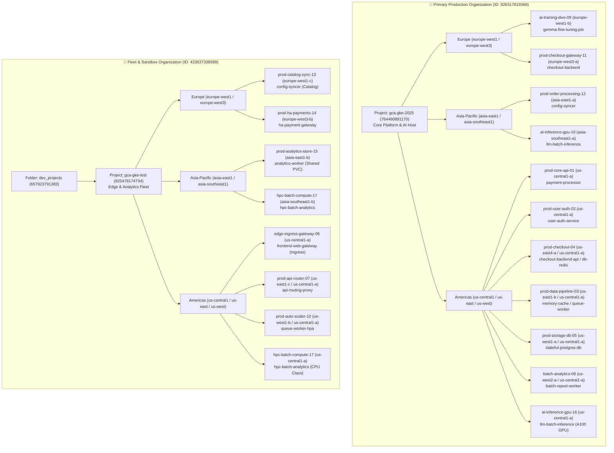

# Global Fleet Topology & Workload Mapping

This document provides a comprehensive mapping of the **Organization ➔ Project ➔ Region ➔ Cluster ➔ Workload** hierarchy managed by this repository across Google Cloud.

---

## 🏢 Multi-Organization Architecture Overview

The multi-cluster fleet spans across **two distinct Google Cloud Organizations**:
* **🏢 Primary Production Organization (`926317919369`)**: Hosts `gca-gke-2025` (Core Transactional & AI Platform).
* **🏢 Dedicated Fleet & Sandbox Organization (`433637338589`)**: Hosts `gca-gke-test` under the `dev_projects` hierarchy (Edge Routing, Analytics & HA Gateways).

---

## 1. Organization `926317919369` / Project: `gca-gke-2025` *(Core Services & Platform)*

### 🇪🇺 Europe Regional Clusters
| Cluster Name | Location | Namespace | Workload(s) & Resource Kind | Business Purpose | GitOps Manifest Location |
| :--- | :---: | :--- | :--- | :--- | :--- |
| **`ai-training-dws-09`** | `europe-west1-b` *(Belgium)* | `ai-training` | `Job/gemma-fine-tuning-job` | DWS Gemma model training | `manifests/workloads/gemma-fine-tuning-job.yaml` |
| **`prod-checkout-gateway-11`** | `europe-west3-a` *(Frankfurt)* | `prod-checkout` | `Deployment/checkout-backend` | EU checkout routing gateway | `manifests/workloads/checkout-backend-service.yaml` |

### 🌏 Asia-Pacific Regional Clusters
| Cluster Name | Location | Namespace | Workload(s) & Resource Kind | Business Purpose | GitOps Manifest Location |
| :--- | :---: | :--- | :--- | :--- | :--- |
| **`prod-order-processing-12`** | `asia-east1-a` *(Taiwan)* | `prod-apps` | `Deployment/config-syncer` `ServiceAccount/restricted-sa` | APAC order lifecycle sync | `manifests/workloads/config-syncer-service.yaml` |
| **`ai-inference-gpu-16`** | `asia-southeast1-a` *(Singapore)* | `ai-inference` | `Deployment/llm-batch-inference` | APAC GPU LLM batch inference | `manifests/workloads/llm-batch-inference-job.yaml` |

### 🇺🇸 Americas Regional Clusters
| Cluster Name | Location | Namespace | Workload(s) & Resource Kind | Business Purpose | GitOps Manifest Location |
| :--- | :---: | :--- | :--- | :--- | :--- |
| **`prod-core-api-01`** | `us-central1-a` | `prod-payments` | `Deployment/payment-processor` | Core payment transactions | `manifests/workloads/payment-processor.yaml` |
| **`prod-user-auth-02`** | `us-central1-a` | `prod-auth` | `Deployment/user-auth-service` | User identity & JWT auth tokens | `manifests/workloads/user-auth-service.yaml` |
| **`prod-checkout-04`** | `us-east4-a` / `us-central1-a` | `prod-checkout` | `Deployment/checkout-backend-api` `StatefulSet/db-redis` | E-commerce checkout backend | `manifests/workloads/checkout-backend-api.yaml` `manifests/workloads/checkout-backend-service.yaml` |
| **`prod-data-pipeline-03`** | `us-east1-b` / `us-central1-a` | `prod-caching` `prod-workers` | `Deployment/memory-cache-service` `Deployment/queue-worker-service` | Redis caching & async queues | `manifests/workloads/memory-cache-service.yaml` `manifests/workloads/queue-worker-service.yaml` |
| **`prod-storage-db-05`** | `us-west1-a` / `us-central1-a` | `prod-databases` | `Deployment/stateful-postgres-db` `PVC/postgres-data-pvc` | Relational database tier | `manifests/workloads/stateful-postgres-db.yaml` |
| **`batch-analytics-08`** | `us-west2-a` / `us-central1-a` | `batch-processing` | `Deployment/batch-report-worker-processor` | Scheduled analytical ETL | `manifests/workloads/batch-report-worker.yaml` |
| **`ai-inference-gpu-16`** | `us-central1-a` | `ai-inference` | `Deployment/llm-batch-inference` `ComputeClass/a100-gpu-class` | High-throughput GPU inference | `clusters/ai-inference-gpu-16/compute-class-a100.yaml` `manifests/workloads/llm-batch-inference-job.yaml` |
| **`ai-training-dws-09`** | `us-central1-a` | `ai-training` | `Job/gemma-fine-tuning-job` | Primary DWS training host | `manifests/workloads/gemma-fine-tuning-job.yaml` |

---

## 2. Organization `433637338589` / Project: `gca-gke-test` *(Edge Routing & Analytics Fleet)*

### 🇪🇺 Europe Regional Clusters
| Cluster Name | Location | Namespace | Workload(s) & Resource Kind | Business Purpose | GitOps Manifest Location |
| :--- | :---: | :--- | :--- | :--- | :--- |
| **`prod-catalog-sync-13`** | `europe-west1-c` *(Belgium)* | `prod-apps` | `Deployment/config-syncer` | EU catalog data replication | `manifests/workloads/config-syncer-service.yaml` |
| **`prod-ha-payments-14`** | `europe-west3-b` *(Frankfurt)* | `prod-payments` | `Deployment/ha-payment-gateway` `Deployment/payment-session-worker` | European HA payment gateway | `manifests/workloads/ha-payment-gateway-service.yaml` |

### 🌏 Asia-Pacific Regional Clusters
| Cluster Name | Location | Namespace | Workload(s) & Resource Kind | Business Purpose | GitOps Manifest Location |
| :--- | :---: | :--- | :--- | :--- | :--- |
| **`prod-analytics-store-15`** | `asia-east1-b` *(Taiwan)* | `prod-analytics` | `Deployment/analytics-worker` `PVC/analytics-shared-pvc` | APAC analytics data ingestion | `manifests/workloads/analytics-worker-service.yaml` |
| **`hpc-batch-compute-17`** | `asia-southeast1-b` *(Singapore)* | `hpc-batch` | `Deployment/hpc-batch-analytics` `ComputeClass/cpu-hpc-compute-class` | APAC HPC batch simulations | `clusters/hpc-batch-compute-17/compute-class-cpu.yaml` `manifests/workloads/hpc-batch-analytics-job.yaml` |

### 🇺🇸 Americas Regional Clusters
| Cluster Name | Location | Namespace | Workload(s) & Resource Kind | Business Purpose | GitOps Manifest Location |
| :--- | :---: | :--- | :--- | :--- | :--- |
| **`edge-ingress-gateway-06`** | `us-central1-a` | `prod-ingress` | `Deployment/frontend-web-gateway` `Service/frontend-web-svc` `Ingress/frontend-web-gateway` | Public SSL edge ingress & CDN | `manifests/workloads/frontend-web-gateway.yaml` |
| **`prod-api-router-07`** | `us-east1-c` / `us-central1-a` | `prod-gateway` | `Deployment/api-routing-proxy` | Global API reverse proxy | `manifests/workloads/api-routing-proxy.yaml` |
| **`prod-auto-scaler-10`** | `us-west1-b` / `us-central1-a` | `prod-workers` | `HPA/queue-worker-hpa` `Deployment/queue-worker-service` | Dynamic queue autoscaling | `manifests/workloads/queue-worker-service.yaml` |
| **`prod-catalog-sync-13`** | `us-central1-a` | `prod-apps` | `Deployment/config-syncer` | US catalog data synchronization | `manifests/workloads/config-syncer-service.yaml` |
| **`prod-ha-payments-14`** | `us-central1-a` | `prod-payments` `webhook-system` | `Deployment/ha-payment-gateway` `Deployment/payment-session-worker` `Deployment/admission-webhook-server` `MutatingWebhook/fleet-policy-enforcer` | HA payment gateway & webhook | `manifests/workloads/ha-payment-gateway-service.yaml` `manifests/workloads/payment-api-gateway.yaml` |
| **`prod-analytics-store-15`** | `us-central1-a` | `prod-analytics` | `Deployment/analytics-worker` `PVC/analytics-shared-pvc` | Shared analytics storage | `manifests/workloads/analytics-worker-service.yaml` |
| **`hpc-batch-compute-17`** | `us-central1-a` | `hpc-batch` | `Deployment/hpc-batch-analytics` `ComputeClass/cpu-hpc-compute-class` | CPU-intensive HPC simulations | `clusters/hpc-batch-compute-17/compute-class-cpu.yaml` `manifests/workloads/hpc-batch-analytics-job.yaml` |

---

## 3. 🖥️ Companion Compute Engine (GCE) Infrastructure (`gce/`)

| Instance / Resource | Zone | Purpose | GitOps Manifest Location |
| :--- | :---: | :--- | :--- |
| **`prod-edge-bastion-gateway`** | `us-central1-a` | Secure jump host & SSH ingress bastion | `gce/prod-edge-bastion-gateway/networking.yaml` |
| **`prod-auth-legacy-vm`** | `us-central1-a` | Legacy authentication bridge service | `gce/prod-auth-legacy-vm/instance.yaml` |
| **`prod-payment-mig-gateway`** | `us-central1-a` | Managed Instance Group for legacy payment routing | `gce/prod-payment-mig-gateway/mig-template.yaml` |
| **`prod-audit-logger-vm`** | `us-central1-a` | Syslog & SIEM audit forwarder | `gce/prod-audit-logger-vm/instance.yaml` |
| **`prod-finops-telemetry-exporter`** | `us-central1-a` | Fleet telemetry & FinOps collector VM | `gce/prod-finops-telemetry-exporter/instance.yaml` |

---

## 4. 🗄️ GCP Shared Infrastructure (`gcp-infrastructure/`)

* **CloudSQL Database Tier**: `gcp-infrastructure/database/cloudsql-instance.yaml`
* **Cloud KMS Keyring & Keys**: `gcp-infrastructure/kms/kms-keyring.yaml`
* **Cloud Storage Buckets**: `gcp-infrastructure/storage/gcs-buckets.yaml`
* **Workload Identity IAM Bindings**: `gcp-infrastructure/iam/workload-identity-bindings.yaml`
* **VPC Networking & Subnets**: `gcp-infrastructure/networking/vpc-network.yaml`
