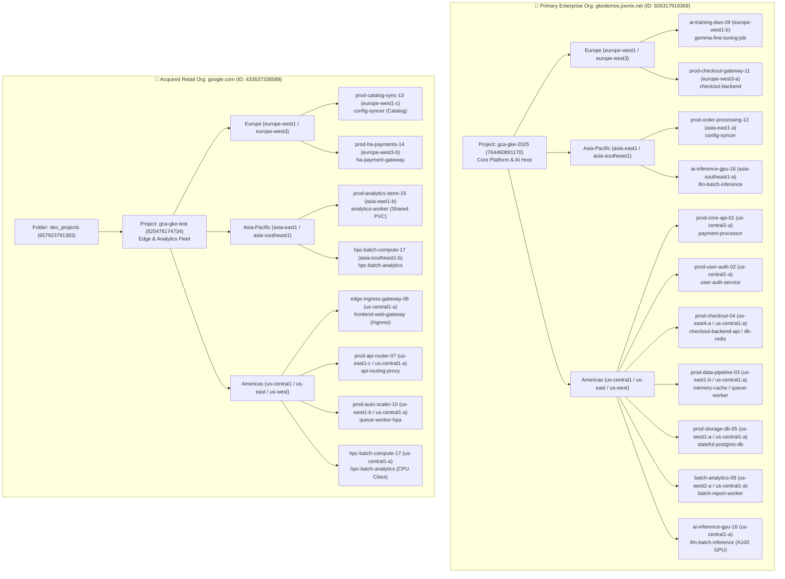

# Global Fleet Topology & Workload Mapping

This document provides a comprehensive mapping of the **Organization ➔ Project ➔ Region ➔ Cluster ➔ Workload** hierarchy managed by this repository across Google Cloud.

---

## 🏢 Multi-Organization Architecture & M&A Context

This infrastructure landscape reflects the real-world **merger of two global e-commerce and retail technology enterprises**. Rather than undertaking an immediate, high-risk single-organization cloud migration, the platform engineering team adopted a unified **GitOps repository (`gke-fleet-iac`)** and **autonomous harness (`kube-agents`)** to manage both historical cloud environments under unified governance:

- **🏢 `gkedemos.joonix.net` (Organization ID: `926317919369`)**:
  - **Role**: Primary acquiring enterprise platform.
  - **Project**: **`gca-gke-2025`** (`764460891170`).
  - **Workloads**: Core payment transactional engines, centralized user identity & authentication (JWT), transactional databases, and cutting-edge generative AI model fine-tuning / GPU inference (DWS / NVIDIA A100s).
- **🏢 `google.com` (Organization ID: `433637338589`)**:
  - **Role**: Acquired global retail brand's historical cloud infrastructure.
  - **Project**: **`gca-gke-test`** (`825476174734`) _(nested under the `dev_projects` folder tree)_.
  - **Workloads**: High-throughput public edge ingress routing, multi-region catalog synchronization, European high-availability payment fallback gateways, and CPU-intensive HPC batch compute.

---

## 1. Organization `gkedemos.joonix.net` (`926317919369`) / Project: `gca-gke-2025`

### 🇪🇺 Europe Clusters (`gca-gke-2025`)

| Cluster Name                   |            Location            | Namespace       | Workload(s) & Resource Kind   | Business Purpose            | GitOps Manifest Location                            |
| :----------------------------- | :----------------------------: | :-------------- | :---------------------------- | :-------------------------- | :-------------------------------------------------- |
| **`ai-training-dws-09`**       |  `europe-west1-b` _(Belgium)_  | `ai-training`   | `Job/gemma-fine-tuning-job`   | DWS Gemma model training    | `manifests/workloads/gemma-fine-tuning-job.yaml`    |
| **`prod-checkout-gateway-11`** | `europe-west3-a` _(Frankfurt)_ | `prod-checkout` | `Deployment/checkout-backend` | EU checkout routing gateway | `manifests/workloads/checkout-backend-service.yaml` |

### 🌏 Asia-Pacific Clusters (`gca-gke-2025`)

| Cluster Name                   |             Location              | Namespace      | Workload(s) & Resource Kind                                   | Business Purpose             | GitOps Manifest Location                           |
| :----------------------------- | :-------------------------------: | :------------- | :------------------------------------------------------------ | :--------------------------- | :------------------------------------------------- |
| **`prod-order-processing-12`** |     `asia-east1-a` _(Taiwan)_     | `prod-apps`    | `Deployment/config-syncer` `ServiceAccount/restricted-sa` | APAC order lifecycle sync    | `manifests/workloads/config-syncer-service.yaml`   |
| **`ai-inference-gpu-16`**      | `asia-southeast1-a` _(Singapore)_ | `ai-inference` | `Deployment/llm-batch-inference`                              | APAC GPU LLM batch inference | `manifests/workloads/llm-batch-inference-job.yaml` |

### 🇺🇸 Americas Clusters (`gca-gke-2025`)

| Cluster Name                |            Location            | Namespace                         | Workload(s) & Resource Kind                                             | Business Purpose                | GitOps Manifest Location                                                                                      |
| :-------------------------- | :----------------------------: | :-------------------------------- | :---------------------------------------------------------------------- | :------------------------------ | :------------------------------------------------------------------------------------------------------------ |
| **`prod-core-api-01`**      |        `us-central1-a`         | `prod-payments`                   | `Deployment/payment-processor`                                          | Core payment transactions       | `manifests/workloads/payment-processor.yaml`                                                                  |
| **`prod-user-auth-02`**     |        `us-central1-a`         | `prod-auth`                       | `Deployment/user-auth-service`                                          | User identity & JWT auth tokens | `manifests/workloads/user-auth-service.yaml`                                                                  |
| **`prod-checkout-04`**      | `us-east4-a` / `us-central1-a` | `prod-checkout`                   | `Deployment/checkout-backend-api` `StatefulSet/db-redis`            | E-commerce checkout backend     | `manifests/workloads/checkout-backend-api.yaml` `manifests/workloads/checkout-backend-service.yaml`       |
| **`prod-data-pipeline-03`** | `us-east1-b` / `us-central1-a` | `prod-caching` `prod-workers` | `Deployment/memory-cache-service` `Deployment/queue-worker-service` | Redis caching & async queues    | `manifests/workloads/memory-cache-service.yaml` `manifests/workloads/queue-worker-service.yaml`           |
| **`prod-storage-db-05`**    | `us-west1-a` / `us-central1-a` | `prod-databases`                  | `Deployment/stateful-postgres-db` `PVC/postgres-data-pvc`           | Relational database tier        | `manifests/workloads/stateful-postgres-db.yaml`                                                               |
| **`batch-analytics-08`**    | `us-west2-a` / `us-central1-a` | `batch-processing`                | `Deployment/batch-report-worker-processor`                              | Scheduled analytical ETL        | `manifests/workloads/batch-report-worker.yaml`                                                                |
| **`ai-inference-gpu-16`**   |        `us-central1-a`         | `ai-inference`                    | `Deployment/llm-batch-inference` `ComputeClass/a100-gpu-class`      | High-throughput GPU inference   | `clusters/ai-inference-gpu-16/compute-class-a100.yaml` `manifests/workloads/llm-batch-inference-job.yaml` |
| **`ai-training-dws-09`**    |        `us-central1-a`         | `ai-training`                     | `Job/gemma-fine-tuning-job`                                             | Primary DWS training host       | `manifests/workloads/gemma-fine-tuning-job.yaml`                                                              |

---

## 2. Organization `google.com` (`433637338589`) / Project: `gca-gke-test`

### 🇪🇺 Europe Clusters (`gca-gke-test`)

| Cluster Name               |            Location            | Namespace       | Workload(s) & Resource Kind                                             | Business Purpose            | GitOps Manifest Location                              |
| :------------------------- | :----------------------------: | :-------------- | :---------------------------------------------------------------------- | :-------------------------- | :---------------------------------------------------- |
| **`prod-catalog-sync-13`** |  `europe-west1-c` _(Belgium)_  | `prod-apps`     | `Deployment/config-syncer`                                              | EU catalog data replication | `manifests/workloads/config-syncer-service.yaml`      |
| **`prod-ha-payments-14`**  | `europe-west3-b` _(Frankfurt)_ | `prod-payments` | `Deployment/ha-payment-gateway` `Deployment/payment-session-worker` | European HA payment gateway | `manifests/workloads/ha-payment-gateway-service.yaml` |

### 🌏 Asia-Pacific Clusters (`gca-gke-test`)

| Cluster Name                  |             Location              | Namespace        | Workload(s) & Resource Kind                                               | Business Purpose              | GitOps Manifest Location                                                                                      |
| :---------------------------- | :-------------------------------: | :--------------- | :------------------------------------------------------------------------ | :---------------------------- | :------------------------------------------------------------------------------------------------------------ |
| **`prod-analytics-store-15`** |     `asia-east1-b` _(Taiwan)_     | `prod-analytics` | `Deployment/analytics-worker` `PVC/analytics-shared-pvc`              | APAC analytics data ingestion | `manifests/workloads/analytics-worker-service.yaml`                                                           |
| **`hpc-batch-compute-17`**    | `asia-southeast1-b` _(Singapore)_ | `hpc-batch`      | `Deployment/hpc-batch-analytics` `ComputeClass/cpu-hpc-compute-class` | APAC HPC batch simulations    | `clusters/hpc-batch-compute-17/compute-class-cpu.yaml` `manifests/workloads/hpc-batch-analytics-job.yaml` |

### 🇺🇸 Americas Clusters (`gca-gke-test`)

| Cluster Name                  |            Location            | Namespace                            | Workload(s) & Resource Kind                                                                                                                                   | Business Purpose                | GitOps Manifest Location                                                                                      |
| :---------------------------- | :----------------------------: | :----------------------------------- | :------------------------------------------------------------------------------------------------------------------------------------------------------------ | :------------------------------ | :------------------------------------------------------------------------------------------------------------ |
| **`edge-ingress-gateway-06`** |        `us-central1-a`         | `prod-ingress`                       | `Deployment/frontend-web-gateway` `Service/frontend-web-svc` `Ingress/frontend-web-gateway`                                                           | Public SSL edge ingress & CDN   | `manifests/workloads/frontend-web-gateway.yaml`                                                               |
| **`prod-api-router-07`**      | `us-east1-c` / `us-central1-a` | `prod-gateway`                       | `Deployment/api-routing-proxy`                                                                                                                                | Global API reverse proxy        | `manifests/workloads/api-routing-proxy.yaml`                                                                  |
| **`prod-auto-scaler-10`**     | `us-west1-b` / `us-central1-a` | `prod-workers`                       | `HPA/queue-worker-hpa` `Deployment/queue-worker-service`                                                                                                  | Dynamic queue autoscaling       | `manifests/workloads/queue-worker-service.yaml`                                                               |
| **`prod-catalog-sync-13`**    |        `us-central1-a`         | `prod-apps`                          | `Deployment/config-syncer`                                                                                                                                    | US catalog data synchronization | `manifests/workloads/config-syncer-service.yaml`                                                              |
| **`prod-ha-payments-14`**     |        `us-central1-a`         | `prod-payments` `webhook-system` | `Deployment/ha-payment-gateway` `Deployment/payment-session-worker` `Deployment/admission-webhook-server` `MutatingWebhook/fleet-policy-enforcer` | HA payment gateway & webhook    | `manifests/workloads/ha-payment-gateway-service.yaml` `manifests/workloads/payment-api-gateway.yaml`      |
| **`prod-analytics-store-15`** |        `us-central1-a`         | `prod-analytics`                     | `Deployment/analytics-worker` `PVC/analytics-shared-pvc`                                                                                                  | Shared analytics storage        | `manifests/workloads/analytics-worker-service.yaml`                                                           |
| **`hpc-batch-compute-17`**    |        `us-central1-a`         | `hpc-batch`                          | `Deployment/hpc-batch-analytics` `ComputeClass/cpu-hpc-compute-class`                                                                                     | CPU-intensive HPC simulations   | `clusters/hpc-batch-compute-17/compute-class-cpu.yaml` `manifests/workloads/hpc-batch-analytics-job.yaml` |

---

## 3. 🖥️ Companion Compute Engine (GCE) Infrastructure (`gce/`)

| Instance / Resource                  |      Zone       | Purpose                                           | GitOps Manifest Location                           |
| :----------------------------------- | :-------------: | :------------------------------------------------ | :------------------------------------------------- |
| **`prod-edge-bastion-gateway`**      | `us-central1-a` | Secure jump host & SSH ingress bastion            | `gce/prod-edge-bastion-gateway/networking.yaml`    |
| **`prod-auth-legacy-vm`**            | `us-central1-a` | Legacy authentication bridge service              | `gce/prod-auth-legacy-vm/instance.yaml`            |
| **`prod-payment-mig-gateway`**       | `us-central1-a` | Managed Instance Group for legacy payment routing | `gce/prod-payment-mig-gateway/mig-template.yaml`   |
| **`prod-audit-logger-vm`**           | `us-central1-a` | Syslog & SIEM audit forwarder                     | `gce/prod-audit-logger-vm/instance.yaml`           |
| **`prod-finops-telemetry-exporter`** | `us-central1-a` | Fleet telemetry & FinOps collector VM             | `gce/prod-finops-telemetry-exporter/instance.yaml` |

---

## 4. 🗄️ GCP Shared Infrastructure (`gcp-infrastructure/`)

- **CloudSQL Database Tier**: `gcp-infrastructure/database/cloudsql-instance.yaml`
- **Cloud KMS Keyring & Keys**: `gcp-infrastructure/kms/kms-keyring.yaml`
- **Cloud Storage Buckets**: `gcp-infrastructure/storage/gcs-buckets.yaml`
- **Workload Identity IAM Bindings**: `gcp-infrastructure/iam/workload-identity-bindings.yaml`
- **VPC Networking & Subnets**: `gcp-infrastructure/networking/vpc-network.yaml`

---

## ❓ Frequently Asked Questions (Architecture & Topology FAQ)

### Q1: Why are our clusters split across two completely separate Google Cloud Organizations?

**Context & Narrative**: Our retail enterprise represents the strategic merger of two technology platforms. `gkedemos.joonix.net` was the acquiring platform's core infrastructure host (`gca-gke-2025`), while `google.com` housed the acquired company's global edge network and catalog fleet (`gca-gke-test`). Rather than risking transactional outages with a monolithic organization migration, we unified both environments using this single GitOps repository (`gke-fleet-iac`) and cross-org Workload Identity trust governed by `kube-agents`.

### Q2: How do microservices communicate across projects and organizations?

Microservices communicate across projects using **Google Cloud Private Service Connect (PSC)** endpoints, **Cloud Armor protected HTTPRoute / Ingress Gateways**, and VPC internal load balancers (`payment-ilb-service`). Edge clusters in `gca-gke-test` terminate external TLS traffic and forward sanitized requests to core microservices in `gca-gke-2025` over authenticated mTLS tunnels.

### Q3: Why are certain cluster names repeated across multiple regions (e.g. `prod-checkout-04`)?

Critical transactional tiers utilize an **Active-Active Multi-Region Resiliency Pattern**. Running paired clusters across US (`us-central1-a`, `us-east4-a`) and Europe (`europe-west3-a`) ensures sub-50ms checkout latency for local shoppers and seamless automated traffic failover during regional maintenance windows. For AI clusters (`ai-training-dws-09`), geo-distribution enables opportunistic scheduling across regional Dynamic Workload Scheduler (DWS) GPU/TPU quota pools.

### Q4: How does GitOps route workloads to the correct cluster tier?

Workloads in `manifests/workloads/` utilize Kubernetes **ComputeClasses** (`a100-gpu-class`, `cpu-hpc-compute-class`) and GKE Fleet Hub cluster selectors. When ArgoCD reconciles manifests, cluster-affinity constraints ensure AI models land exclusively on GPU node pools while payment gateways deploy to PCI-DSS hardened clusters.

### Q5: What is the persistence source of truth: CloudSQL or in-cluster PostgreSQL?

**CloudSQL (`gcp-infrastructure/database/cloudsql-instance.yaml`)** is the primary, ACID-compliant system of record for financial transactions and account balances. In-cluster PostgreSQL (`stateful-postgres-db`) and Redis (`db-redis`) instances serve as regional read-replicas, caching layers, and session state stores to minimize cross-region database latency.

### Q6: Why are Compute Engine (GCE) VMs included in this Kubernetes repository?

This repository enforces a **Hybrid Modernization Architecture**. Certain critical enterprise legacy components — such as the PCI-DSS certified HSM payment gateway (`prod-payment-mig-gateway`) and the legacy LDAP authentication bridge (`prod-auth-legacy-vm`) — run on managed Compute Engine VMs. Keeping their Terraform and networking definitions alongside GKE ensures changes to upstream APIs do not break downstream VM dependencies.

### Q7: How does `kube-agents` audit both organizations without credential leakage?

The central Platform Agent runs on `platform-agent` in `gca-gke-2025` using Google Cloud Workload Identity. Secondary projects (like `gca-gke-test`) grant least-privilege telemetry and audit viewer roles (`roles/container.viewer`, `roles/logging.viewer`, `roles/monitoring.viewer`) to the Platform Agent's Google Service Account, eliminating long-lived service account keys across organization boundaries.
